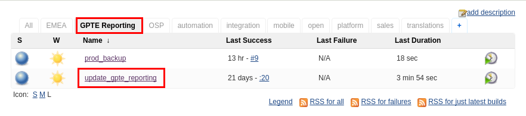
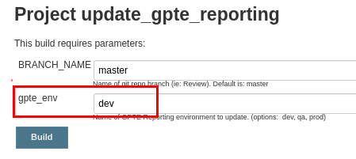
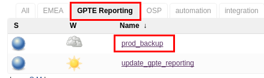

:uri:
:toc: manual
:toc-placement: preamble
:numbered:
:rulesspreadsheet: link:https://docs.google.com/spreadsheets/d/1C4jbSADmHJvLL3PBBBSEB54L8G_I6NN5rblWIGymAXg/edit#gid=1640119171[GPTE Accreditation Rules Spreadsheet with validation]
:designdoc: link:https://docs.google.com/document/d/1rFioqj5uhLtdoUEfHHBEwh4_-bW7vqEc5N0R24tN9FU/edit#[GPTE Reporting design document]

= GPTE Reporting

Administration Guide

== Overview

=== Purpose and design
High level purpose and system design of the `GPTE Reporting` project can be found in the  {designdoc} (best viewed in Google Chrome).

=== Audience
The intended audience of this document architects, developers and administrators of the GPTE Reporting solution.

== Pre-Reqs

=== Technical

. Github account with, at a minimum, `viewer` credentials to the `github.com/redhat-gpe` organization
. Workstation (bare metal or VM) with 8GB RAM, 4 CPUs and 100GB disk

=== Skills

. RHCSA or equivalent experience.
. Experience with Ansible
. Experience with Git.
. Experience with Java development and its defacto build tool: Maven.
. Experience with JBoss EAP administration.
. Experience developing services using JBoss Fuse.
. Experience with the Drools and Dashbuilder components of JBoss BPMS.
. Experience with database development and administration using MariaDB.

== GPTE Reporting URLs

GPTE Reporting has three environments:  prod, qa and dev.

FQDN of each environment is as follows:

. *prod* :   reporting.opentlc.com
. *qa*   :   qa.opentlc.com
. *dev*  :   dev.opentlc.com

Each of these environments runs the same GPTE Reporting services.

URLs to each GPTE Reporting service are as follows:

. *Dashbuilder* :  https://<fqdn>/dashbuilder

== Provisioning
Review `base_install.yml` and `update.yml` scripts in _$PROJECT_HOME/infrastructure/ansible_ directory.

== Updating

It is possible to update all GPTE Reporting environment (prod, qa & dev) via GPTE's Jenkins environment.

A Jenkins pipeline has been created that triggers the ansible provisioning and updating functionaility of GPTE Reporting.

To update a GPTE Reporting environment, execute the following:

. Point your browser to:  `https://forge.opentlc.com/jenkins`
. Authenticate using your _OPENTLC_ userId and password.
. Navigate to `GPTE Reporting -> update_gpte_reporting`
+

. In the left panel, click: `Build with Parameters`.
. In the _gpte_env_ parameter, specify the environment that should be updated (prod, qa, dev):
+

. Click: `Build`.
. Click the _build #_ for the Jenkins build that is now in progress.
. From the left panel, click: `Console Output` 
. Monitor the output of the update process

== Production Database Disaster Recovery

=== Backup
. The following two production databases are periodically backed up:
.. `lms_transactional`
.. `lms_reporting`

. This back up happens nightly at 11:30pm EST.
. The backup occurs via a Jenkins job
+

. A zip of both databases can be found at the following: `forge.opentlc.com:/tmp/mysqlbackup_target/`

=== Recovery
If the production database at `reporting.opentlc.com` was to be lost, then it could be fully recovered as follows:

. Re-provision `reporting.opentlc.com` from ansible
. Populate the `lms_transactional` and `lms_reporting` databases from the backups:
.. ssh reporting.opentlc.com
.. mkdir -p /tmp/mysqlbackup_target
.. scp forge.opentlc.com:/tmp/mysqlbackup_target/* /tmp/mysqlbackup_target
.. unzip both files in /tmp/mysqlbackup_target
.. Use the command line mysql utility to import into each corresponding database.

NOTE: the `dashbuilder` database will also be needed.  The `dashbuilder` database can be dumped from `dev.opentlc.com`.

== GPTE Reporting Database

=== Manual tasks to _lms_transactional_ database

. Seed the `lms_transactional` database with test data
+
-----
mysql -u root lms_transactional <  db_scripts/lms_transactional_ddl.sql
mysql -u root lms_transactional < db_scripts/lms_transactional_data.sql
-----

. Periodically, create a new test datafile from a current snapshot of your `lms_transactional` database.
+
This database is used to support development and unit testing of GPTE Reporting project:
+
-----
# slim down size of lms_transactional database
mysql -u root lms_transactional -e "delete from Students where StudentID > 10399"

# Data dump to a file
mysqldump --no-create-db --no-create-info -u root lms_transactional > db_scripts/lms_transactional_data.sql

# Dump of lms_transactional schema
mysqldump -d -u root lms_transactional > db_scripts/lms_transactional_ddl.sql
-----

. Export Courses and Mappings as tsv for upload into Accreditation Rules Spreadsheet
+
-----
echo 'select cm.PrunedCourseId, c.CourseId, c.CourseName from Courses c left join CourseMappings cm on cm.courseId = c.courseId' | mysql -u root -p -B lms_transactional > /tmp/Courses_\&_Mappings.tsv
-----

== Refresh `Courses` & `CourseMappings` tables

. Make changes to the _Courses & Mappings_ sheet of {rulesspreadsheet}.
+
NOTE: Not every courseId is going to have a corresponding mapping.
For those courses without a mapping, the _PrunedCourseId_ field can either have a value of `NULL` or can be blank.

. File -> Download As -> Tab-separated values (*.tsv, current sheet)
. Using your Red Hat email account, create an email with the following:
.. *To*:  rhtgptetest@yahoo.com
.. *Subject*: Course Refresh
.. *Attachment*: attach previously downloaded tsv.
. Tail log of GPTE Reporting server of  development environment.
.. ssh <opentlc userId>@dev.opentlc.com
.. Execute the following: tg
. Send email
. Expect results similar to the following in the log file:
+
-----
imaps://imap.mail.yahoo.com) Received file from: [<jbride@redhat.com>, <jbride@redhat.com>], subject course refresh
imaps://imap.mail.yahoo.com) moveAttachmentsToBodyAndSendToGPTEProcessingRoute() received the following # of attachments: 1
imaps://imap.mail.yahoo.com) determineAttachmentType() attachment type = course_mappings_spreadsheet
vm://cc_process-new-courses-and-mappings-uri) Following # of records deleted from Course and CourseMappings tables: 89 :  0
vm://cc_process-new-courses-and-mappings-uri) insertIntoCourseAndMappings() no mapping found for: CLI-DEL-ADCM-5593-AST
vm://cc_process-new-courses-and-mappings-uri) insertIntoCourseAndMappings() no mapping found for: MWS-DEL-ADEI-1626-AST
vm://cc_process-new-courses-and-mappings-uri) insertIntoCourseAndMappings() no mapping found for: MWS-DEL-ADMOB-7543-AST
vm://cc_process-new-courses-and-mappings-uri) Just refreshed Course and CourseMappings using the following # of records:  453
-----

== GPTE Reporting: Manual Build

-----
cd $PROJECT_HOME
mvn clean install -DskipTests
-----

== GPTE Reporting Routing Process

GPTE Reporting includes a service called: `gpte_shared_process`.
This service executes within JBoss Fuse on EAP and its purpose is the following:

. Consume data feeds sent to GPTE Reporting from external systems and users.
+
Examples include course completions from Dokeos and student registration data from Sumtotal.
+
This service consumes data files from a variety of endpoints such as email and local filesystem.
. Light validation of the data file (ie: proper sender email account and correct file suffix).
. Route the datafile for further processing to one of the other GPTE Reporting services also residing in the same JBoss Fuse on EAP JVM.

== Student Registration Process

== GPTE IPA integration

== Course Completion Process

=== Dokeos Course Completions
Dokeos tends to send course completions to GPTE Reporting in near real-time.
In particular, an email with a single course completion attachment file is sent as soon a student completes a course in rh.dokeos.com.

An example of a dokeos course completion can be found link:https://github.com/redhat-gpe/OPEN_Reporting/blob/master/course_completion_process/src/test/resources/sample-spreadsheets/dokeos/app_dev_eap_new.csv[here].

Upon consumption of the course completion email from dokeos, GPTE Reporting will :

. Validate the course completion.  In particular, ensure that the course referenced in the course completion is a known GPTE canonical course name as specified in lms_transactional.Courses.
. Persist the course completion (assuming the course completion validates).

Since course completions from dokeos are typically processed individually and in real time, there has not been a need to log a _Summary_ report with the processing of each course completion.
Instead, statements similar to the following are currently all that will be written to the GPTE Reporting log file (execute:  `tg` ):

-----
akropachev@bellintegrator.com : Adding student course to db: 'Red Hat OpenStack Platform for Sales' '100'
akropachev@bellintegrator.com : converting from sumtotal course completion to canonical StudentCourse. ActivityCode = CLI-SSE-IAS-11410-AST
Adding student course to db: 'Red Hat OpenStack Platform for Sales' '100'
-----

If an error occurs during either the validation or persistence of a course completion from rh.dokeos.com, an email will be sent out to GPTE Reporting system admins.

=== Sumtotal Batch upload

==== Course Completion Processing Report
The following provides instructions on how to review a summary of the processing of a batch of Sumtotal course competions in GPTE Reporting:

. ssh into the dev environment of GPTE Reporting
. Tail the JBoss EAP log file by executing:  `tg`

. Email the batch file of Sumtotal course completions to the dev email address: 
`rhtgptetest@yahoo.com`
. Wait for anywhere between 5 - 45 seconds.  See <<troubleshoot_emails>> if nothing is observed.
. Observe the beginning of the log file for a _SumtotalCourseCompletions report_.
It will appear similar to the following:
+
-----
********** validateSumtotalCourseCompletions report:   **********
# of initial course completions  = 3348
# of rejected course completions = 0
# of course validation problems = 0
# of unknownCourseProblems = 8
# of course completions to persist = 3340
****************************************
-----

NOTE:  The above report does not list number of duplicate course completions that may or may not have been in the course completion attachment.
That information is not available from GPTE Reporting.

==== Course Completion Error detail files

Various text files that provide more details of problems that may have occurred during processing of Sumtotal batch course completion attachment files can be found on the dev machine at: `/tmp/gpte/courseCompletionIssues/` .

== Accreditation Process

The GPTE Reporting service is a stand-alone (it does not run in JBoss EAP), Camel based, Java process.

Its purpose is to :

. Parse and validate GPTE accreditation rules (in tab-delimited spreadsheet format) into Drools Rule Language (DRL) format.
. Determine accreditations based on student's course completions.
+
In particular, the `accred-process` background job periodically determines new accreditations based on new course completions that have entered the system during that time period.

==== Start Accreditation Process

Shell aliases have been provided to easily bounce all GPTE Reporting services.

Take a look at the aliases found in:  `/etc/bashrc`.

==== Monitor Accreditation Process log

Shell aliases have been provided to easily tail log files of all GPTE Reporting services.

Take a look at the aliases found in:  `/etc/bashrc`.

==== Execute Rules Spreadsheet Validation and Parsing to DRL

. Makes changes to any of the three following tabs of the {rulesspreadsheet}
.. `DCI Accreditation Rules`
.. `MWS Accreditation Rules`
.. `CI Accreditation Rules`
. For those spreadsheets that have changed, download them to your local workstation
.. File -> Download As -> Tab-separated values (*.tsv, current sheet)
. Using your Red Hat email account, create an email with the following:
.. *To*:  rhtgptetest@yahoo.com
.. *Subject*: <DCI | MWS | CI> Accreditation Rule Refresh
.. *Attachment*: attach previously downloaded tsv.
. Tail log of GPTE `Accreditation Service` of development environment.
.. ssh <opentlc userId>@dev.opentlc.com
.. Execute the following:  ta
. Send email
. Expect results similar to the following in the log file:
+
-----
INFO  -new-accreditation-spreadsheet - Received rules spreadsheet.  name= GPTE Accreditation Rules with Validation - DCI Accreditation Rules.tsv : from= , subject=
INFO  AccreditationProcessBean       - changeSuffixOfRuleFileName() new rule file name = GPTE Accreditation Rules with Validation - DCI Accreditation Rules.drl
INFO  ate-drl-from-rules-spreadsheet - create-drl-from-rules-spreadsheet:  will create the following # of rules: 54 .
INFO  ate-drl-from-rules-spreadsheet - create-drl-from-rules-spreadsheet:  DRL path= src/main/resources/rules   : file name= GPTE Accreditation Rules with Validation - DCI Accreditation Rules.drl
INFO  ate-drl-from-rules-spreadsheet - create-drl-from-rules-spreadsheet:   Completed DRL generation to: src/main/resources/rules GPTE Accreditation Rules with Validation - DCI Accreditation Rules.drl
-----
. After all rule spreadsheets have been emailed and processed, bounce the GPTE `Accreditation Service`
.. At the command line of the dev environment, execute:  ba

==== Invoke accreditation logic REST service
By default, the `accred-process` service runs as a background job that periodically determines accreditations.

The `accred-process` service allows also allows for manual triggering of accreditation logic processing on one or more students.

==== Full Accreditation Refresh
This approach will delete all existing accreditations in the `StudentAccreditations` table.

It will then re-calculate all accreditations for all students based on their existing course completions.

. SSH into GPTE Reporting operating as the `jboss` operating system user.
. Change directories to OPEN_Reporting
. Ensure that `accred-process` JVM is running.
. Execute:
+
-----
./bin/accreditation_batch_evaluation.sh -env=[prod | dev]
-----

==== Focused Accreditation Refresh

. Invoke accreditation logic on an existing student whose course completions should lead to an accreditation
+
-----
curl -v -X PUT  -H "ACCEPT: application/json" \
                -H "IDENTIFY_FIRED_RULES_ONLY: true" \
                -H "RESPOND_JSON: true" \
                http://$HOSTNAME:9090/gpte_accreditation/students/10387
-----

. Invoke accreditation logic on a non existent student
+
-----
curl -v -X PUT  -H "ACCEPT: application/json" \
                -H "IDENTIFY_FIRED_RULES_ONLY: true" \
                -H "RESPOND_JSON: true" \
                http://$HOSTNAME:9090/gpte_accreditation/students/103899
-----

. Invoke accreditation logic on all students whose studentid > 10000 and < 11000
+
-----
curl -v -X PUT  -H "ACCEPT: application/json" \
                -H "IDENTIFY_FIRED_RULES_ONLY: true" \
                -H "RESPOND_JSON: true" \
                -H "LOW_STUDENT_ID: 10000" \
                -H "HIGH_STUDENT_ID: 11000" \
                http://$HOSTNAME:9090/gpte_accreditation/students/batch
-----

== SkillsBase Integration

=== QA
The following are steps and considerations for conducting QA of SkillsBase Integration functionality.

. Authentication

.. GPTE currently has two Skills Base instances:
+
-----
Test instance: https://app.skills-base.com/o/redhattest
Production instance: https://app.skills-base.com/o/redhat
-----

.. Each Skills Base instance can have one unique key pair active at any time.
+
The key pair is used to request OAuth2 access tokens via the Skills Base API that can then be used to make API requests.

.. Note that a maximum of one access token per instance can be active at any one time.
+
More information is available here: http://wiki.skills-base.net/index.php?title=API_introduction#Authentication

. Check # of Red Hat associates whose accreds need to be pushed to SkillsBase
+
-----
MariaDB [lms_transactional]> select count(sa.studentId) from StudentAccreditations sa, Students s where sa.Processed=0 and s.StudentId=sa.StudentID and s.email like "%redhat.com";
-----

. SkillsBase data schema

.. The `SkillsBase Integration Service` of GPTE Reporting maintains state (in the lms_transactional database) regarding if a student is known to have a SkillsBase account and if a particular accreditation has been pushed to skillsbase.
+
This database state is found in the following fields:

... *Students.SkillsbaseStatus* :   boolean; 0 if student does not have a skillsbase account
... *StudentAccreditations.Processed* : boolean; 0 if student accreditation has been pushed to SkillsBase 

.. Prepare for end-to-end test using only student = gpse.training+1@redhat.com
+
-----
MariaDB [lms_transactional]>  update StudentAccreditations sa, Students s set sa.Processed=1 where s.StudentId=sa.StudentID and s.email like "%redhat.com";
MariaDB [lms_transactional]>  update StudentAccreditations sa, Students s set sa.Processed=0 where s.StudentId=sa.StudentID and s.email="gpse.training+1@redhat.com";
MariaDB [lms_transactional]>  update Students set SkillsbaseStatus=1 where Email like "%redhat.com";
MariaDB [lms_transactional]>  update Students set SkillsbaseStatus=0 where Email="gpse.training+1@redhat.com";
-----

. flip SkillsBase integration swithch:
.. Edit properties/{env}.properties :
+
-----
    sb_sendMailToStudentEnabled=true
    accred_process-push-qualification-to-skillsbase-batch=quartz2://accred_process-push-qualifications-to-skillsbase?cron=0 0/5 * 1/1 * ? *
-----
.. Bounce accreditation process and tail its log file:
+
-----
ba
ta
-----
. Send one or more course completions to GPTE Reporting that lead to an existing accreditation.

=== SkillsBase Log Statements

The following can be expected in the log file of the GPTE Reporting _accreditation process_ (execute: `ta`):

. *Qual does not already exist in SkillsBase*
+
-----
INFO  AccreditationProcessBean       - jbride@redhat.com : skillsbase personId = 295
    statusCode = 200
    response content length = -1
    response reason phrase = OK
    response: {"status":"success","data":[{"name":"Bachelor of Science in Material Science Engineering, Univ. of Michigan, Ann Arbor","person_id":295,"status":"completed","start_date":"Sep-03-1990","end_date":"Apr-30-1994"}]}
INFO  push-qual-to-skills-base       - jbride@redhat.com : Red Hat Advanced Delivery Specialist - Cloud Management : Does not already exist in skillsbase.  Will now post to skillsbase
INFO  AccreditationProcessBean       - jbride@redhat.com : Sending the following qualification to Skills Base web service : Red Hat Advanced Delivery Specialist - Cloud Management
INFO  AccreditationProcessBean       - jbride@redhat.com : addQualification() 
    endDate = 2019-04-13
    response: {"status":"success","message":null,"data":null} : status = success
INFO  push-qual-to-skills-base       - jbride@redhat.com : Student qualification complete:  assessment=Red Hat Advanced Delivery Specialist - Cloud Management
-----

. *Qual already exists in SkillsBase*
+
-----
INFO  AccreditationProcessBean       - jbride@redhat.com : skillsbase personId = 295
    statusCode = 200
    response content length = -1
    response reason phrase = OK
    response: {"status":"success","data":[{"name":"Bachelor of Science in Material Science Engineering, Univ. of Michigan, Ann Arbor","person_id":295,"status":"completed","start_date":"Sep-03-1990","end_date":"Apr-30-1994"},{"name":"Red Hat Advanced Delivery Specialist - Cloud Management","person_id":295,"status":"completed","start_date":"Apr-13-2017","end_date":"Apr-13-2019"}]}
INFO  push-qual-to-skills-base       - jbride@redhat.com : Qualification already exists in SkillsBase: Red Hat Advanced Delivery Specialist - Cloud Management.  Will not post to Skills Base
-----

== Emails
GPTE Reporting has services that for various business use cases both sends and consumes emails.

=== Sending emails

GPTE Reporting has the ability enable / disable the delivery of emails.
This feature is may be useful in the `dev` and/or `qa` environment.

. Edit /opt/OPEN_Reporting/properties/<env>.properties.
. Change value of the following property:
+
-----
gpte_enable_all_emails=<true/false>
-----
.  Save the change.
.  Bounce GPTE Reporting service:  `bg`
. OPTIONAL:  view delivery of emails to remote mail router:
+
-----
$ tail -f /var/log/maillog
-----

[[troubleshoot_emails]]
=== Troubleshoot Consumption of Emails

GPTE Reporting consumes, parses and processes the data from emails to support various functionality, ie:  course completions and student registrations.

While tailing the log file of GPTE Reporting (ie:  `tg` ), if no indication of the consumption of that email appears, one of the following may be the root problem:

. *Unknown attachment type*
+
GPTE Reporting's email inboxes receive spam.
If the email attachment is of an unknown type, the email is not processed and no log is written.
Make sure you are sending a known attachment type.
If working with the GPTE Reporting dev environment, try sending a known working email attachment:  ie, resend a single test course completion.

. *Camel Mail component connection is stale*
.. The Camel _mail_ component is used to consume emails.
More often than not, consumption of those emails occurs with out issue.  ie: The camel mail component has been running fine in production for months.
.. Occasionally, however, it might appear that the Camel _mail_ component may have gone stale.
+
To troubleshoot, start by logging into the email provider and: `mark your email as unsent`.
The camel mail provider should detect the presence of this email.

.. If you still don't observe any indication of the email being processed, bounce GPTE Reporting (ie:   `bg`).

ifdef::showscript[]

=== activemq-artemis install

NOTE:  artemis is not yet used.  Disregard this section

-----
# sudo yum install -y libaio-devel
# sudo su - jboss
$ cd /opt
$ git clone https://github.com/apache/activemq-artemis.git
$ cd activemq-artemis
$ mvn -Prelease install -DskipTests
$ cd artemis-distribution/target/apache-artemis-1.4.0-SNAPSHOT-bin/apache-artemis-1.4.0-SNAPSHOT
-----

endif::showscript[]
